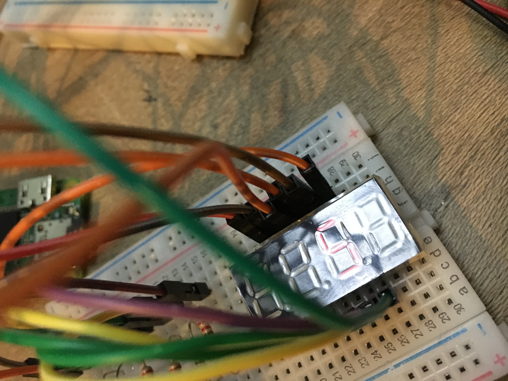

# segment

A Go library for using 4 digit, 7 segment displays (e.g. 3461BS) with the Raspberry Pi.

It will scroll or display text in addition to numbers.



## Example

```go
err := rpio.Open()
if err != nil {
  fmt.Printf("error: %v\n", err)
  os.Exit(1)
}
defer rpio.Close()

// Setup the display.
// Row 1 (top row of pins).
pD1 := rpio.Pin(8) // BCM pin, see https://pinout.xyz
pa := rpio.Pin(7)
pf := rpio.Pin(16)
pD2 := rpio.Pin(20)
pD3 := rpio.Pin(26)
pb := rpio.Pin(19)
// // Row 2 (bottom row of pins).
pe := rpio.Pin(13)
pd := rpio.Pin(6)
pdp := rpio.Pin(5)
pc := rpio.Pin(0)
pg := rpio.Pin(11)
pD4 := rpio.Pin(9)

disp := segment.NewFourDigitSevenSegmentDisplay(pD1, pa, pf, pD2, pD3, pb, pe, pd, pdp, pc, pg, pD4)
disp.Start(context.Background(), "hello")

reader := bufio.NewReader(os.Stdin)

for {
  s, _ := reader.ReadString('\n')
  disp.Update(s)
}
```

## Related projects

If you're interested in using Go with the Raspberry Pi, you might also like:

* https://github.com/a-h/beeper
* https://github.com/a-h/keypad
